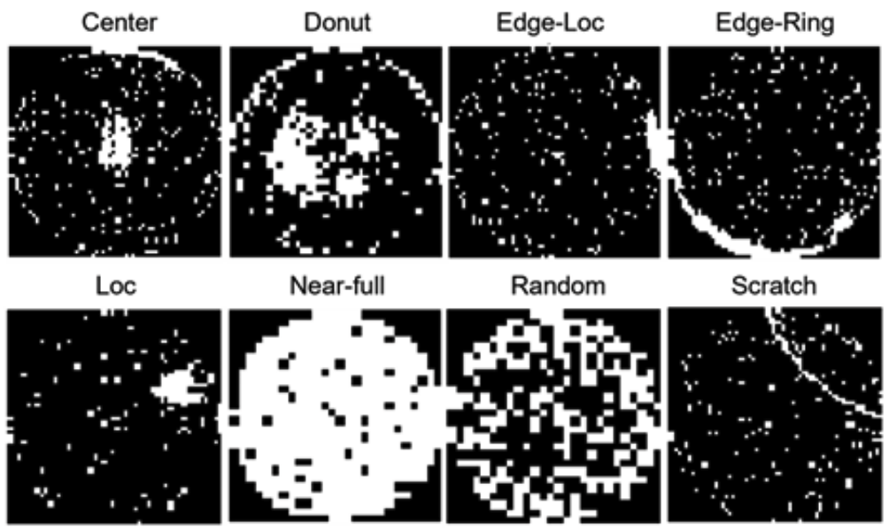

# 🔬 SCRBLAA-Net: Wafer Defect Classification
**Official PyTorch Implementation & Interactive Simulator**

*웨이퍼 불량 패턴 분류를 위한 시공간(Spatio-Temporal) 하이브리드 아키텍처 재현 및 검증 파이프라인*

 

## 📢 Publication
본 저장소는 SCIE 저널 **[The International Journal of Advanced Manufacturing Technology (JCR Q2)]**에 게재된 연구의 핵심 아키텍처 구현체이자, 상이한 하드웨어 환경에서의 모델 재현성(Reproducibility)을 검증한 프로젝트입니다.

> **Combining Residual Network and Bidirectional Long Short-Term Memory with Additive Attention for Wafer Defect Classification** 
> *Gyumin Kang, et al.* 
> 🔗 [Read the Article on Springer](https://link.springer.com/article/10.1007/s00170-025-16934-5)

 

## 🚀 1. Interactive Wafer Map Simulator (Download)
논문에서 제안된 모델의 작동 원리와 8가지 웨이퍼 결함 패턴의 활성화(Activation) 과정을 직접 조작하며 확인할 수 있는 **웹 기반 시뮬레이터 파일**을 제공합니다. 

👉 **[시뮬레이터 다운로드 (Wafer_Map_Simulator.html)](https://github.com/Yani-Studio/Wafer-Defect-Classification-SCRBLAA-Net/raw/main/Visualization/Wafer_Map_Simulator.html)**

*💡 **How to run:** 위 링크를 클릭하여 파일을 다운로드한 뒤, Chrome, Safari, Edge 등 웹 브라우저로 열면 별도의 환경 설정 없이 즉시 인터랙티브 데모를 체험하실 수 있습니다.*

 

## 📈 2. Reproduction Performance & Variance Analysis

본 저장소의 코드는 논문의 아키텍처를 PyTorch 기반으로 동일하게 구현하였으며, 상이한 인프라 환경에서의 오차 분석을 수행했습니다.

* **Original Paper Performance:** `Test Accuracy 94.98%` (NVIDIA RTX 3090 Ti 24GB / CUDA Environment)
* **Local Reproduction Performance:** `Test Accuracy 94.10%` / `Macro F1-Score 0.9173` (MacBook Apple Silicon / MPS Environment)

**💡 성능 재현 오차(Reproduction Variance) 고찰:**
논문에 제시된 94.98%의 성능은 하이엔드 데스크톱 환경(NVIDIA RTX 3090 Ti)과 CUDA 백엔드 상에서 고정된 난수 시드(Random Seed) 최적화를 통해 도출된 지표입니다. 본 로컬 환경(MacBook Apple Silicon)에서의 재현 결과(94.10%)와 약 0.88%p의 미세한 수치적 편차가 발생하는 원인은 다음과 같습니다.

1. **Hardware Core Architecture:** NVIDIA CUDA 가속 환경과 Apple Silicon MPS(Metal Performance Shaders) 아키텍처 간의 텐서 연산 알고리즘 및 부동소수점(Floating-point) 정밀도 처리 방식의 하드웨어적 차이.
2. **Stochastic Backend Variance:** 프레임워크 백엔드 최적화 솔루션의 상이함으로 인해 발생하는 가중치 초기화 및 가속화 연산 과정에서의 확률적(Stochastic) 변동성.

이러한 하드웨어 및 라이브러리 백엔드의 환경적 차이에도 불구하고 94% 이상의 높은 분류 정확도와 0.91 이상의 안정적인 Macro F1-Score를 방어해 낸다는 점은, **제안된 SCRBLAA-Net 아키텍처가 특정 하드웨어 인프라에 종속(Overfitting)되지 않고 다양한 배포 환경에서 견고한 일반화 성능(Robustness)을 유지함**을 정량적으로 증명합니다.

 

## 🧠 3. Model Architecture (SCRBLAA-Net)

CNN의 전역적 공간 특징 추출 능력과 RNN의 시퀀스 문맥 이해 능력을 결합한 하이브리드 모델입니다.

  

1. **Shortcut3-ResNet (SCR5):** Binarized Wafer Map에서 공간 특징(Spatial Feature) 추출
2. **Sliding-Window Tokenization:** 고차원 특징 벡터를 중첩된 형태의 순차적 토큰으로 변환
3. **Bi-LSTM & Additive Attention:** 양방향 시퀀스를 분석하고, 불량 특징이 강하게 나타나는 윈도우에 동적으로 어텐션 가중치 부여

 

## 🔍 4. Data Preprocessing

미세한 결함 패턴을 극대화하고 공정 노이즈를 억제하기 위해 **고속 이진화(Binarization) 파이프라인**을 적용했습니다.

  

*(위 이미지는 전처리가 완료된 8가지 고장 유형의 흑백 이진화 웨이퍼 맵 샘플입니다.)*

 

## 🛠️ Tech Stack
* **Deep Learning Framework:** PyTorch (MPS / CUDA Support)
* **Data Processing:** NumPy, Pandas, OpenCV, Scikit-Learn
* **Visualization & Demo:** Matplotlib, Seaborn, HTML5/CSS/Vanilla JS
